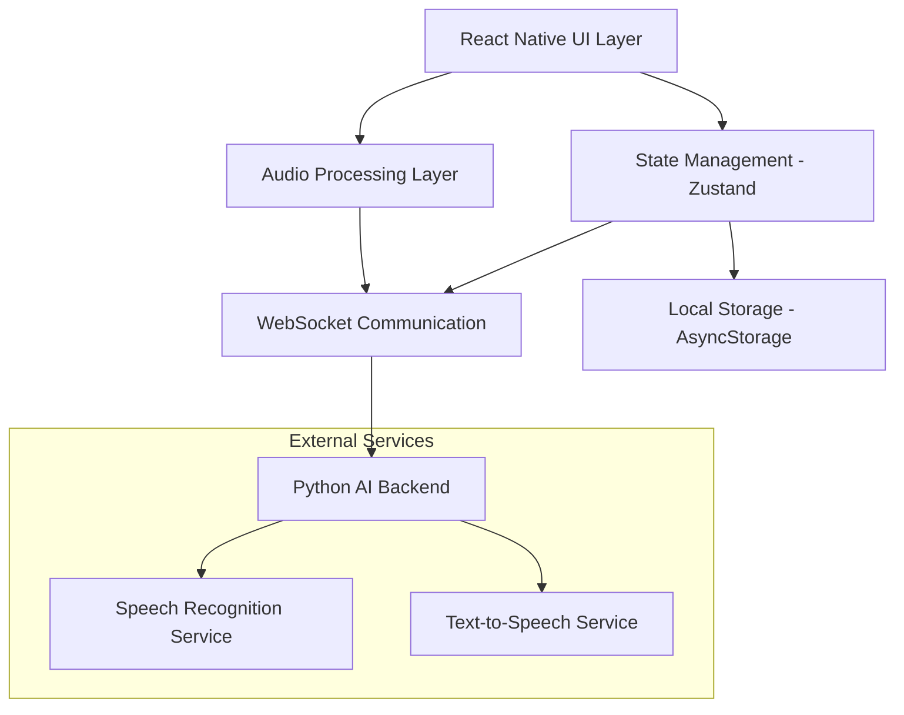
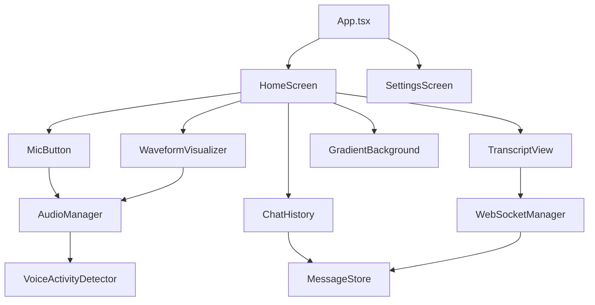

# Design Document

## Overview

The Personal AI Assistant App is architected as a React Native application with real-time audio processing, WebSocket-based backend communication, and a sophisticated animated UI. The app follows a state machine pattern for managing voice interaction flows and uses modern React Native libraries for audio capture, waveform visualization, and smooth animations.

The architecture prioritizes low-latency audio streaming, responsive UI animations, and reliable real-time communication with a Python backend. The design emphasizes modularity, testability, and performance optimization for smooth 60fps animations and sub-200ms voice interaction response times.

## Architecture

### High-Level Architecture



### Component Architecture



## Components and Interfaces

### Core Components

#### 1. HomeScreen Component
**Purpose:** Main application screen containing all voice interaction UI elements

**Props Interface:**
```typescript
interface HomeScreenProps {
  navigation: NavigationProp<any>;
}
```

**State Management:**
- Uses Zustand store for global app state
- Manages current interaction state (idle, listening, processing, responding)
- Handles error states and user feedback

#### 2. MicButton Component
**Purpose:** Interactive microphone button that morphs into waveform visualizer

**Props Interface:**
```typescript
interface MicButtonProps {
  state: 'idle' | 'listening' | 'processing';
  onPress: () => void;
  disabled?: boolean;
}
```

**Animation System:**
- Uses react-native-reanimated for smooth morphing animations
- Implements spring-based transitions for natural feel
- Supports haptic feedback on interaction

#### 3. WaveformVisualizer Component
**Purpose:** Real-time audio waveform visualization during recording

**Props Interface:**
```typescript
interface WaveformVisualizerProps {
  audioLevels: number[];
  isActive: boolean;
  style?: ViewStyle;
}
```

**Rendering Strategy:**
- Uses react-native-svg for performant vector graphics
- Implements exponential decay filtering for smooth amplitude transitions
- Optimized for 60fps rendering with minimal re-renders

#### 4. TranscriptView Component
**Purpose:** Displays live transcription with typewriter effect

**Props Interface:**
```typescript
interface TranscriptViewProps {
  transcript: string;
  isPartial: boolean;
  isVisible: boolean;
}
```

**Features:**
- Typewriter animation for streaming text
- Handles partial vs final transcript states
- Auto-scrolling for long transcripts

#### 5. ChatHistory Component
**Purpose:** Scrollable list of conversation messages

**Props Interface:**
```typescript
interface ChatHistoryProps {
  messages: Message[];
  onMessagePress?: (message: Message) => void;
}
```

**Performance Optimizations:**
- Uses FlatList with getItemLayout for smooth scrolling
- Implements message virtualization for large histories
- Supports pull-to-refresh for message sync

### Service Layer Interfaces

#### AudioManager Interface
```typescript
interface AudioManager {
  startRecording(): Promise<void>;
  stopRecording(): Promise<AudioBuffer>;
  getAudioLevels(): number[];
  isRecording(): boolean;
  requestPermissions(): Promise<boolean>;
}
```

#### WebSocketManager Interface
```typescript
interface WebSocketManager {
  connect(url: string): Promise<void>;
  disconnect(): void;
  sendAudioChunk(chunk: ArrayBuffer): void;
  sendMessage(message: string): void;
  onTranscriptPartial(callback: (text: string) => void): void;
  onTranscriptFinal(callback: (text: string) => void): void;
  onAssistantResponse(callback: (token: string) => void): void;
}
```

#### MessageStore Interface
```typescript
interface MessageStore {
  messages: Message[];
  addMessage(message: Omit<Message, 'id' | 'createdAt'>): void;
  updateMessage(id: string, updates: Partial<Message>): void;
  clearHistory(): void;
  getMessageById(id: string): Message | undefined;
}
```

## Data Models

### Message Model
```typescript
interface Message {
  id: string;
  role: 'user' | 'assistant';
  text: string;
  createdAt: number;
  status?: 'sending' | 'sent' | 'error';
  metadata?: {
    audioUrl?: string;
    confidence?: number;
    processingTime?: number;
  };
}
```

### AppState Model
```typescript
interface AppState {
  // Interaction State
  currentState: 'idle' | 'listening' | 'processing' | 'responding';
  isConnected: boolean;
  hasPermissions: boolean;
  
  // Audio State
  audioLevels: number[];
  isRecording: boolean;
  currentTranscript: string;
  isTranscriptPartial: boolean;
  
  // Settings
  settings: {
    ttsEnabled: boolean;
    asrBackend: 'default' | 'whisper' | 'google';
    theme: 'dark' | 'light';
    privacyMode: boolean;
  };
  
  // Error Handling
  lastError?: {
    type: 'permission' | 'network' | 'audio' | 'backend';
    message: string;
    timestamp: number;
  };
}
```

### WebSocket Message Protocols
```typescript
// Client to Server
interface AudioChunkMessage {
  type: 'audio_chunk';
  data: ArrayBuffer;
  sampleRate: number;
  timestamp: number;
}

interface TranscriptMessage {
  type: 'transcript_final';
  text: string;
  timestamp: number;
}

// Server to Client
interface PartialTranscriptMessage {
  type: 'transcript_partial';
  text: string;
  confidence: number;
}

interface AssistantResponseMessage {
  type: 'assistant_response';
  token: string;
  isComplete: boolean;
}
```

## Error Handling

### Error Categories and Strategies

#### 1. Permission Errors
**Strategy:** Graceful degradation with clear user guidance
- Display permission request dialog with explanation
- Provide settings deep-link for manual permission grant
- Show alternative interaction methods when permissions denied

#### 2. Network Errors
**Strategy:** Automatic retry with exponential backoff
- Implement WebSocket reconnection logic
- Cache messages for retry when connection restored
- Display connection status indicator

#### 3. Audio Processing Errors
**Strategy:** Fallback mechanisms and user feedback
- Retry audio initialization on failure
- Provide manual recording controls as fallback
- Clear error messages with suggested solutions

#### 4. Backend Service Errors
**Strategy:** Graceful handling with user notification
- Parse backend error responses for user-friendly messages
- Implement request timeout handling
- Provide offline mode when backend unavailable

### Error Recovery Patterns

```typescript
interface ErrorRecoveryStrategy {
  maxRetries: number;
  retryDelay: number;
  fallbackAction?: () => void;
  userNotification: {
    title: string;
    message: string;
    actions: Array<{
      label: string;
      action: () => void;
    }>;
  };
}
```

## Testing Strategy

### Unit Testing
**Framework:** Jest with React Native Testing Library

**Coverage Areas:**
- Component rendering and prop handling
- State management logic (Zustand stores)
- Audio processing utilities
- WebSocket message handling
- Error handling functions

**Key Test Scenarios:**
```typescript
describe('MicButton', () => {
  it('should transition to listening state on press');
  it('should show disabled state when permissions denied');
  it('should trigger haptic feedback on interaction');
});

describe('AudioManager', () => {
  it('should request permissions before recording');
  it('should provide real-time audio levels');
  it('should handle recording interruptions gracefully');
});
```

### Integration Testing
**Framework:** Detox for E2E testing

**Critical User Flows:**
1. First-time app launch and permission flow
2. Complete voice interaction cycle (tap → speak → receive response)
3. Settings configuration and persistence
4. Network connectivity changes during interaction
5. Background/foreground app transitions during recording

### Performance Testing
**Metrics to Monitor:**
- Animation frame rate (target: 60fps)
- Audio processing latency (target: <50ms)
- Memory usage during extended conversations
- WebSocket message throughput
- App startup time

**Testing Tools:**
- React Native Performance Monitor
- Flipper for debugging and profiling
- Custom performance logging for audio pipeline

### Accessibility Testing
**Requirements:**
- Screen reader compatibility for all UI elements
- Voice Over navigation support
- High contrast mode support
- Keyboard navigation (for external keyboards)
- Reduced motion preferences

## Performance Optimizations

### Audio Pipeline Optimization
- Use native audio processing modules for low-latency capture
- Implement audio buffer pooling to reduce garbage collection
- Optimize WebSocket chunk size for network efficiency
- Use Web Audio API features where available

### UI Rendering Optimization
- Implement proper React.memo usage for expensive components
- Use FlatList optimization techniques for chat history
- Leverage react-native-reanimated for GPU-accelerated animations
- Implement proper image caching for any visual assets

### Memory Management
- Implement proper cleanup in useEffect hooks
- Use WeakMap for component references where appropriate
- Monitor and limit chat history size in memory
- Implement proper WebSocket cleanup on component unmount

### Network Optimization
- Implement message queuing for offline scenarios
- Use compression for WebSocket messages where beneficial
- Implement proper request deduplication
- Cache static assets and configuration data